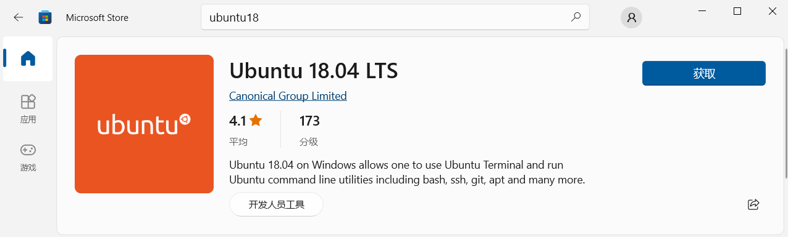
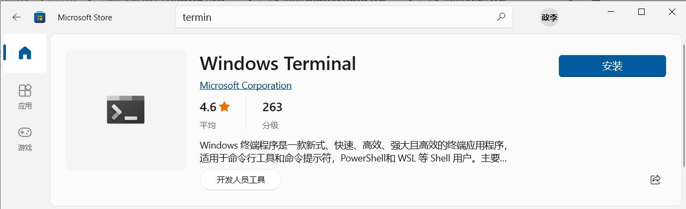

wsl配置
===================

1. 启动wsl插件
----------------

::

    控制面板 -> 程序 -> 启用或关闭windows功能

    - Hyper-V
    - 适用于Linux的windows子系统

1. 安装ubuntu1804
-------------------

- 在Microsoft Store中下载ubuntu1804, 下载完毕后启动完成安装

3. 安装terminal
-------------------

- 在Microsoft Store中下载terminal

4. wsl1升级为wsl2
-------------------

下载升级组件

.. _vscode-gdb配置: http://120.48.82.24:9100/note_linux_env/tools/vscode.tar.gz

.. code-block:: c

    wsl --set-default-version Ubuntu18.04 2   

5. wsl迁移
-------------------

.. code-block:: shell

    # 导出配置
    wsl --export Ubuntu-18.04 E:\wsl18\wsl.tar

    # 确定在此目录下可以看见备份wsl.tar文件之后, 注销原有的wsl
    wsl --unregister Ubuntu-18.04

    # 将备份文件恢复到F:\wsl中去
    wsl --import Ubuntu-18.04 E:\wsl E:\wsl18\wsl.tar

    # 恢复默认用户
    Ubuntu1804 config --default-user zw
