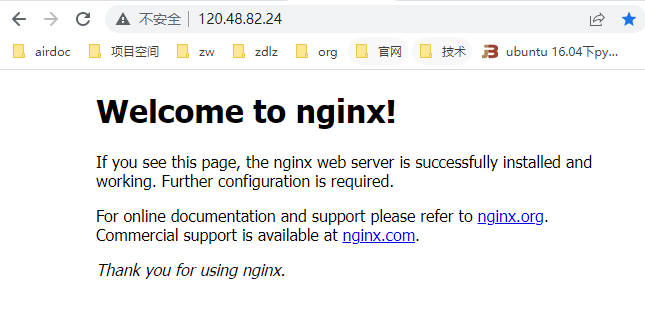

# 网站搭建

## 1 购买服务器

- 服务器可以给我们提供固定的IP地址，以便在任何有网络的地方都可以访问。我们把网站挂载到服务器上，这样就可以通过此ip来访问我们的网站。由于百度云新人有活动，因此买了半年的百度云服务器。


| 服务器商     | 价格(1G内存 1核) |
| ------------ | ---------------- |
| 阿里云服务器 | 130 / 每月       |
| 百度云服务器 | 15元 / 半年      |

- 个人网站搭建使用的资源较小，一般使用1G内存、1个CPU就可以了。以下是我的服务器配置

| 参数名称 | 参数             |
| -------- | ---------------- |
| 系统     | ubuntu-18.04     |
| CPU      | 单核             |
| 内存     | 1G               |
| 磁盘     | 40G              |
| 带宽     | 3Mbps            |
| 公网IP   | **120.48.82.24** |


## 2 配置服务器环境

- 通过ssh命令登录远程服务器，这里以root身份登录，实际的IP以自己购买的服务器为准。

```shell
ssh root@120.48.82.24
```

- 安装基础环境

```shell
apt-get update
apt-get upgrade
apt-get install vim git nginx
```

- 执行完上述命令后输入IP地址既可访问网站首页




## 3 配置一个网站

配置单网站的功能比较简单，直接替换/var/www/html中的网页即可


## 4 配置多网站

- 在/etc/nginx/conf.d目录下新建文件test1.conf，表示第一个网站配置

```c
server {
   listen        9101;									// 要监听的端口号，端口号别和系统冲突就行
   server_name   120.48.82.24;
   location  / {
     root  /var/www/test1;								// 该站点html源文件路径
     index index.html;
   }
}
```

- 在/etc/nginx/conf/conf.d目录下新建文件test2.conf，表示第二个网站配置

```c
server {
   listen        9102;									// 要监听的端口号，端口号别和系统冲突就行
   server_name   120.48.82.24;
   location  / {
     root  /var/www/test2;								// 该站点html源文件路径
     index index.html;
   }
}
```

- 网站访问方式通过ip地址 + 端口号访问

```
第一个网站URL：120.48.82.24:9101
第二个网站URL：120.48.82.24:9102
```


## 5 nginx常用命令

- 重新加载nginx，修改完html后，可以调用此命令重新加载服务器来刷新页面

```shell
systemctl reload nginx
```

