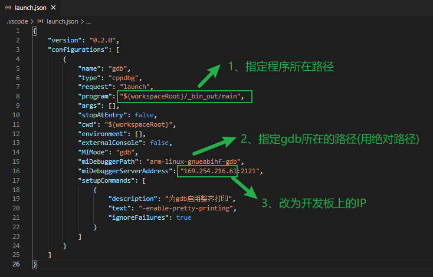

============
GDB + VSCODE
============

参考配置
--------

=============== ===================================================================================
vscode-gdb配置_ vscode配置
vscode-gdb模板_ vscode模板
=============== ===================================================================================

配置PC端环境
------------

- 添加vscode gdb配置
    下载 vscode-gdb配置_ 到源码根目录下后解压.

- 配置launch.json

配置嵌入式端环境
----------------

- 推送gdbserver到开发板/usr/bin目录下

- 下表列出常用的arm-linux-gcc官网

========== ========================================================================================
Linaro-gcc https://releases.linaro.org/components/toolchain/binaries
========== ========================================================================================

启动VSCODE + GDBSERVER调试
--------------------------

- 开发板端

::
   
   # IP地址填PC端的(非wsl ip地址)
   gdbserver 169.254.216.21:2121 main

- PC端

    打开vscode输入F5即可进入调试

启动GDB + GDBSERVER调试
-----------------------

- 开发板端

::
   
   # IP地址填PC端的(非wsl ip地址)
   gdbserver 169.254.216.21:2121 main

- PC端

::

   $ arm-linux-gnueabi-gdb main
   (gdb) target remote 169.254.216.77   // 开发板ip

======================== ==========================================================================
l                        查看源码
b main.c:9               在main.c文件的第9行插入断点
s                        单步进入
n                        单步执行
p                        打印变量
x/<num><格式><对齐> addr 查看内存地址, 常用(x/40xh 0x1000)
show dir                 显示搜索路径
dir /xx/xx/source        添加源码搜素路径
info sharedlibray xxx.so 查看加载的库信息
======================== ==========================================================================

.. warning::

   - PC和嵌入式板需要相互ping通
   - vscode调试动态库只需要把动态库源码拷贝到工程下(GDB + GDBSERVER方式需要手动添加动态库源码路径)

调试问题汇总
------------

- 运行gdb提示无python环境

::

   apt-get install libpython2.7
   sudo apt-get install libatlas3-base

.. _vscode-gdb配置: http://120.48.82.24:9100/note_linux_env/tools/vscode.tar.gz
.. _vscode-gdb模板: http://120.48.82.24:9100/note_linux_env/tools/gdb_sample.tar.gz
