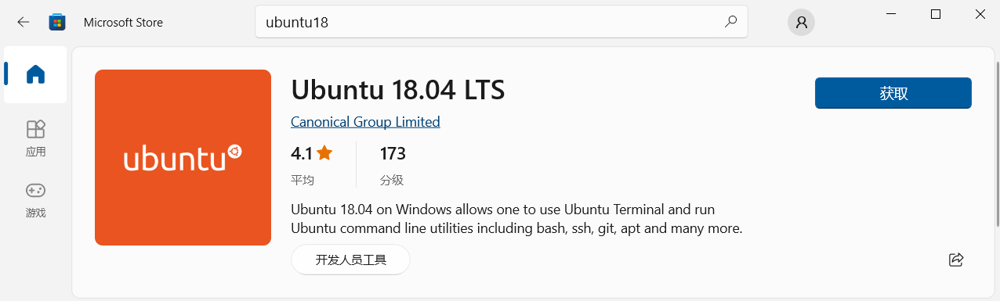
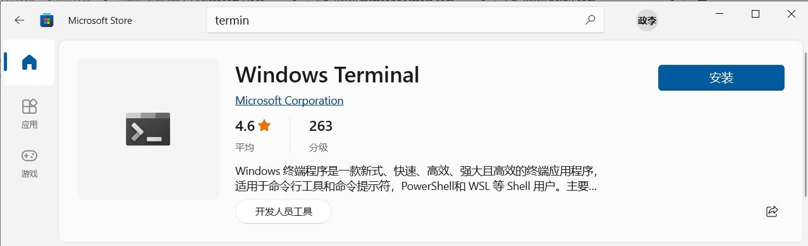

# WSL2环境搭建

## 一、WSL介绍

Wsl - windows subsystem for linux，可以在windows上使用linux开发，并且可以直接调用windows命令。wsl基于hyper5虚拟机（win10内置）


## 二、官方文档连接

[https://docs.microsoft.com/zh-cn/windows/wsl/install](https://docs.microsoft.com/zh-cn/windows/wsl/install)  


## 三、WSL基础组件安装


- 在[Microsoft Store](https://aka.ms/wslstore)获取并安装Ubuntu18




- 在[Microsoft Store](https://aka.ms/wslstore)获取并安装Windows Terminal




- 下载并安装WSL2升级组件

[wsl内核升级组件](https://wslstorestorage.blob.core.windows.net/wslblob/wsl_update_x64.msi)


- 下载WSL迁移工具

[LxRunOffline-v3.5.0-mingw.zip](http://120.48.82.24:9100/note_linux_env/ubuntu/LxRunOffline-v3.5.0-mingw.zip)


## 四、WSL配置
- 打开PowerShell执行如下命令

```PowerShell
PS> wsl --install                                           // 安装WSL
PS> wsl --set-default-version Ubuntu18.04 2                 // 设置WSL版本为WSL2
PS> .\LxRunOffline.exe move -n Ubuntu-18.04 -d D:\wsl       // 迁移WSL2到D盘
PS> .\LxRunOffline.exe get-dir -n Ubuntu-18.04              // 查看是否迁移成功
```

